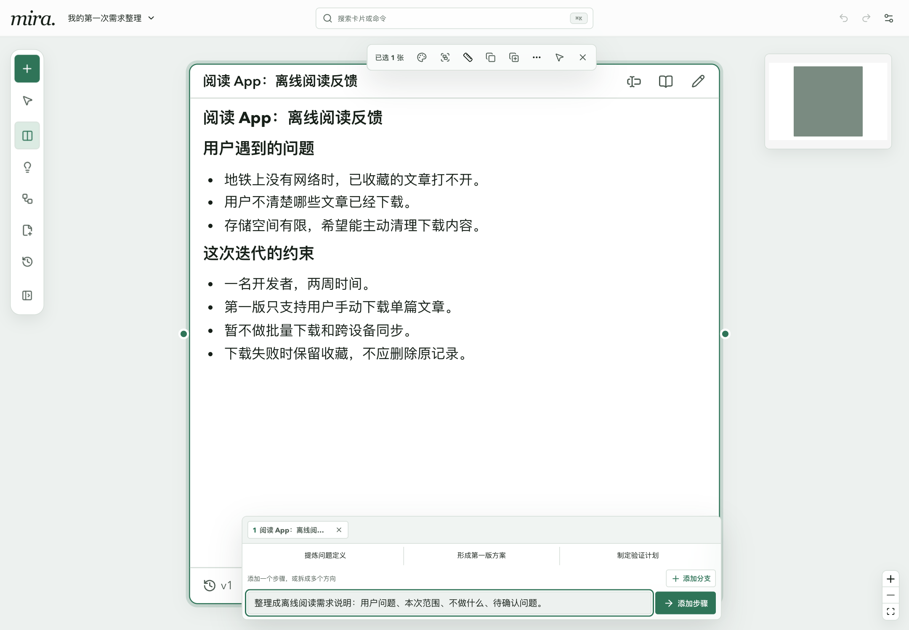

# 第一次用 Mira：把一份反馈变成需求清单

[返回项目介绍](../../README.md) · [看更多案例](use-cases.md) · [完整手册](user-guide.md)

这个练习用一份虚构的阅读 App 反馈，带你完成「写材料 → 添加步骤 → 生成 → 自己修改」。启动并连接模型后，预留约 5–10 分钟；模型耗时因服务而异。不需要预先理解流程、Agent 或 API。

## 先打开 Mira

如果已有内部桌面包，打开应用并选择一个可读写文件夹作为工作区。当前桌面包仅用于内部测试；[获取方式与平台说明](../operations/desktop-internal-builds.md)。

从源码运行则先安装 Node.js `>=22.12.0` 与 pnpm，在仓库根目录执行：

```sh
pnpm install
pnpm build
pnpm start
```

在浏览器打开 [Mira](http://127.0.0.1:56300/graphmind/)。默认在仓库内保存数据，需要独立文件夹时参考[工作区配置](user-guide.md#13-standalone三条命令启动)。同一工作区不要同时开启桌面版与另一服务实例。

点击右上角「系统设置 → 模型设置」，填写你使用的服务地址、模型 ID 与所需密钥，先「测试连接」，再「保存设置」。这些网页设置只对当前服务进程有效，退出并重启后可能需要重新填写。

选择来源后，下一步建议也可能调用模型并发送来源全文。本练习只使用下方的虚构文字。没有模型也可以完成写卡、编辑与添加步骤；生成需要可用的模型连接。

## 1. 建一张自己的画板

点击顶栏当前画板名称，选择「新建画板」，输入「我的第一次需求整理」，点击「新建并打开」。

你会看到一张空画布。桌面左侧是工作工具栏；窄屏时工具栏位于底部。

## 2. 写下第一份材料

点击工具栏「新建」，或双击画布空白处。把下面整段复制到正文编辑器：

```markdown
# 阅读 App：离线阅读反馈

## 用户遇到的问题
- 地铁上没有网络时，已收藏的文章打不开。
- 用户不清楚哪些文章已经下载。
- 存储空间有限，希望能主动清理下载内容。

## 这次迭代的约束
- 一名开发者，两周时间。
- 第一版只支持用户手动下载单篇文章。
- 暂不做批量下载和跨设备同步。
- 下载失败时保留收藏，不应删除原记录。
```

点击「保存正文」，或按 `Cmd/Ctrl + Enter`。关闭详情回到画布，你应该看到一张有正文的材料卡。材料、草稿与成果使用同一种卡片。

## 3. 告诉 Mira 下一步要什么

单击卡片标题栏选中它，底部会出现来源和成果输入区。确认来源是刚才的材料，再输入：

```text
整理成一份离线阅读需求说明，分为用户问题、本次范围、不做什么、待确认问题。
只使用来源中的事实，不确定的信息明确标为待确认，不要自行扩大两周的开发范围。
```

点击「添加步骤」。此时你应该看到原材料、一块转化步骤，以及一张等待生成的空成果卡。



这一步还没有生成成果。「添加步骤」是在确定做什么；下一步才执行。

## 4. 生成，然后加入你的判断

在刚创建的转化块上点击「运行到这里」。运行时可以查看进度或停止；完成后，正文出现在原来的空目标卡中。

阅读结果，确认它没有增加批量下载或跨设备同步。点击成果卡上的「编辑内容」，补上你自己的决定，例如：

```text
人工确认：第一版只在文章详情页提供下载入口，暂不新增独立下载管理页。
```

再次「保存正文」。成果现在既有 AI 的整理，也有你的决定。保存后的正文形成新版本；可以从卡片的版本入口查看历史。

如果运行期间你修改并保存了目标正文，模型返回后可能显示「有一个待比较结果」。打开比较，决定「采用为最新版本」还是「丢弃结果」；Mira 不会静默覆盖你保存的内容。

## 5. 用这份成果继续推进

关闭详情，选中需求说明卡，在底部输入：

```text
把这份已经确认的需求变成验收清单。每条写出前置条件、用户操作、可观察的结果，
覆盖下载成功、下载失败、离线打开与清理下载；不加入来源之外的新功能。
```

再次「添加步骤」，然后在新步骤上「运行到这里」。你现在有了一条材料 → 需求说明 → 验收清单的路径，可以逐张修改。


*这是同一课题的进阶案例：反馈和约束拆开，需求分出回归与发布支线，周三又加入新反馈。首次练习只需完成上面的两步；想继续探索，可以[导入完整案例](../examples/README.md)。图中正文为人工示例，模型实际输出会不同。*

## 再试一个小变化

回到原材料，补写一条新的用户反馈并保存。之前生成的需求说明对应步骤会提示「来源已变化」，旧结果仍保留。确认要更新后，在验收步骤点击「运行到这里」，Mira 会检查必要的上游步骤并更新到这里。

两步成果都经过你检查后，可以打开第一步的关系详情，把这段已经走通的路径「保存为方法」。下次从「方法与计划」使用它，手动绑定新材料、确认添加，再按需运行。保存的是方法，不是这次项目的正文。

要留下阶段成果，可以从「画布版本」手动保存一个稳定版本。从旧画布版本继续工作会创建新副本，不覆盖当前画板。

## 卡住时看这里

| 看到的情况 | 下一步 |
| --- | --- |
| 底部没有成果输入框 | 先保存材料并单击卡片选中；详情打开时可先关闭详情 |
| 添加步骤后成果还是空的 | 在转化块点击「运行到这里」 |
| 提示没有可用模型 | 回到「系统设置 → 模型设置」，测试连接并保存；确认服务没有刚重启 |
| 运行失败 | 查看运行详情中的原因，调整服务或材料后重试；原内容仍在 |
| 有待比较结果，无法继续 | 先比较并采用或丢弃结果，再继续运行 |
| 画布太大，找不到卡片 | 顶部搜索卡片名称或正文；桌面也可按 `Cmd/Ctrl + K` |
| 提示工作区已被占用 | 退出另一可写 Mira 实例；异常残留按[工作区锁恢复](../operations/workspace-lock-recovery.md)处理 |

下一次换成自己的课题：[读书、研究或创作案例](use-cases.md)。想查快捷键、灵感池、备份与文件使用，打开[完整手册](user-guide.md)。
