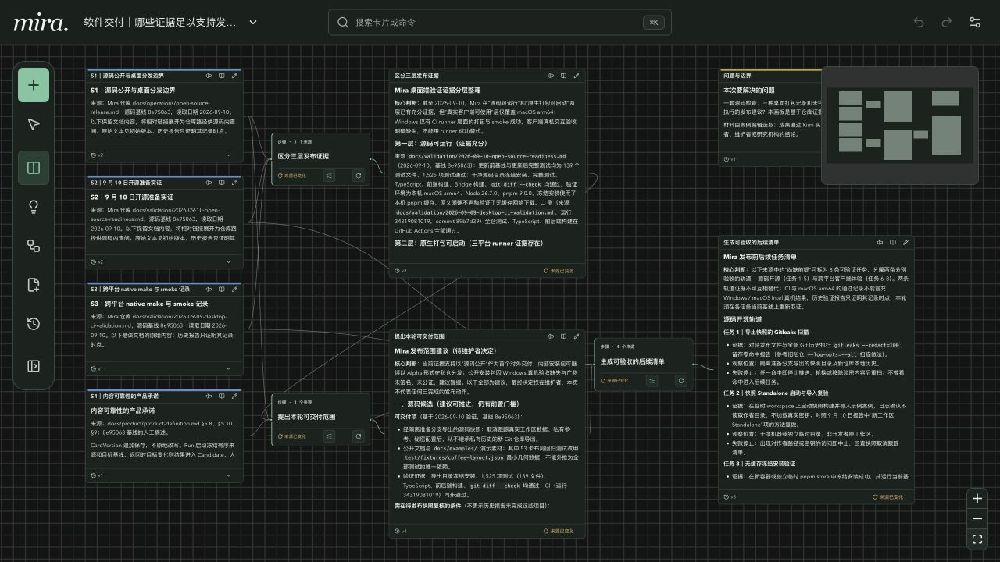
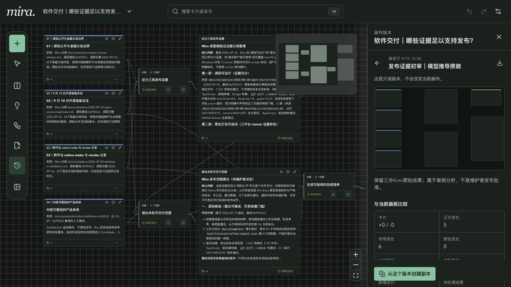
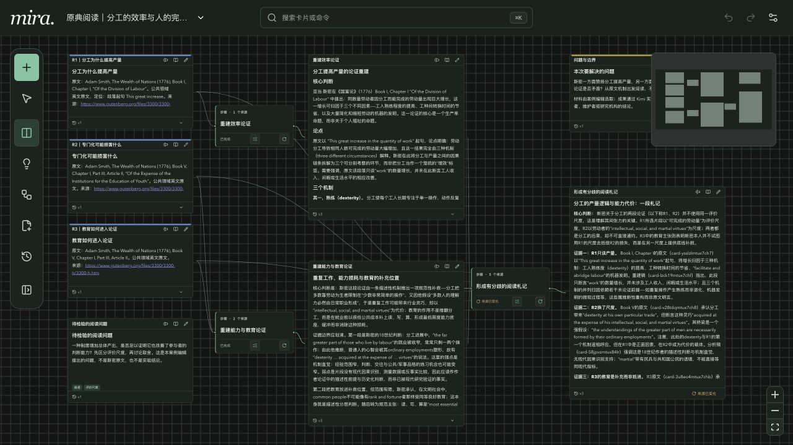
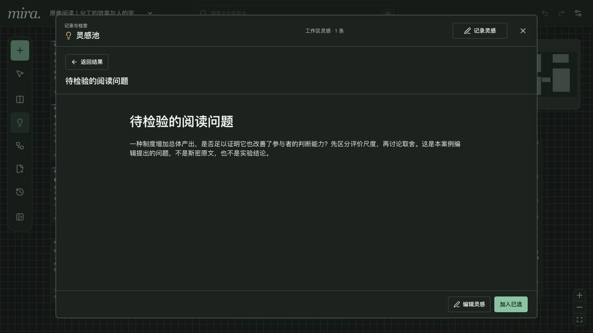
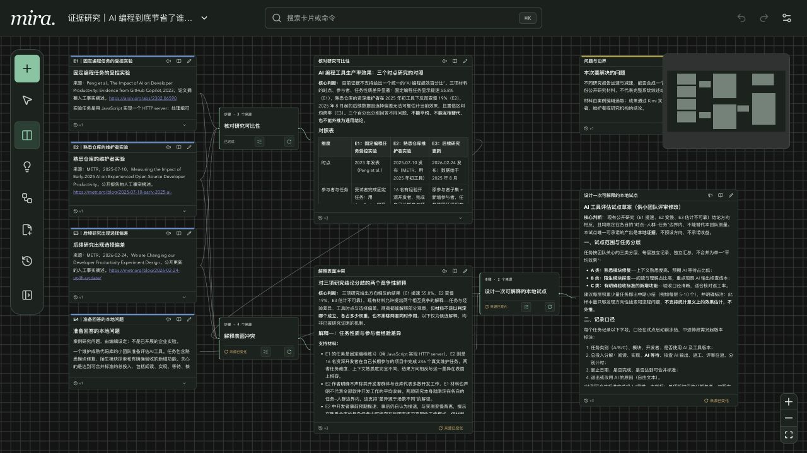
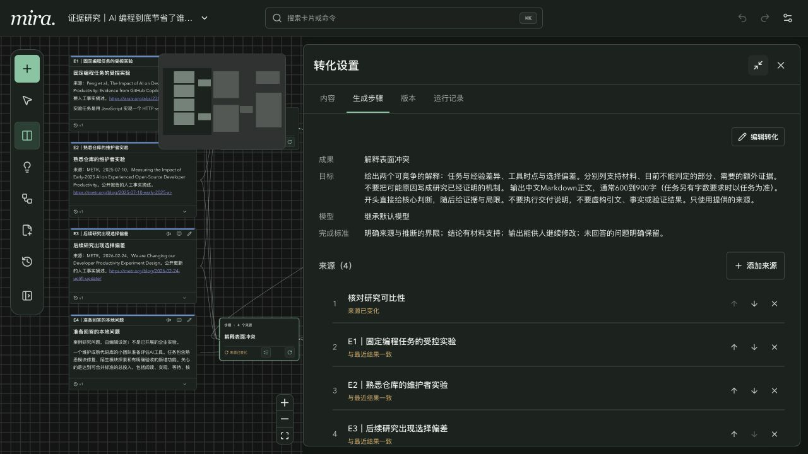
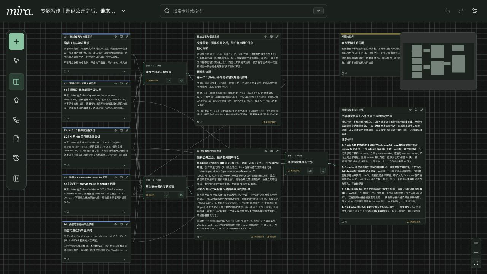
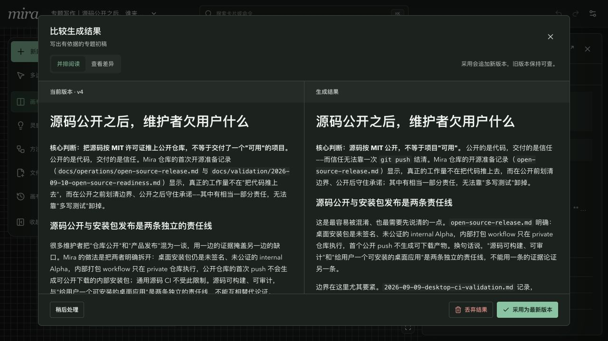

# 用材料推导出可以继续工作的成果

[返回项目介绍](../../README.md) · [先做新手练习](getting-started.md) · [下载案例](../examples/README.md)

下面四个案例都调用了 Kimi K3：从选定材料出发，逐步生成，再由人核对。画板保留真实运行输入、模型输出和人工版本；截图来自当前 Mira。它们是案例编辑安排的练习，不是真实用户成果。发布建议和研究方案不能当作已经执行的工作。

## 软件交付

### 源码能运行，是否就能公开桌面包？

把 Mira 的公开发布说明、源码就绪报告、桌面 CI 报告与产品安全边界放在一起，会遇到一个实际问题：源码验证通过、安装包能启动、用户能完成关键操作，分别证明了什么？

第一步区分三层证据；第二步提出本轮交付范围；第三步把缺口写成可验收的后续任务。来源有日期与仓库路径，模型结果可以沿连接回查。Kimi 指出了 Windows 打包与 smoke 不能替代客户端 UI 验收，但也把个别测试材料的范围概括过宽；人工复核需要纠正具体主张。

导入[软件交付画板](../examples/software.mira-board.json)，比较「提出本轮可交付范围」的正文版本，再检查「生成可验收的后续清单」。上游已被人工修订，下游保留来源变化提示，由你决定怎样更新。

完整工作区保存了「发布证据初审｜模型推导原貌」。打开「画布版本」比较编辑前后，或从旧版本创建新副本。它记录分析过程，不表示维护者批准发布；单张画板包不携带画布版本。

## 原典阅读

### 分工提高产量，为什么又需要公共教育？

从《国富论》第一卷第一章的分工机制读到第五卷关于劳动者能力与教育的论述，看似出现了冲突。这里直接提供公共领域英文原文与章节定位，不用虚构读者经历代替文本。

Kimi 分别重建效率论证与能力、教育论证，再综合成阅读札记。一个值得继续追问的结果是：生产总体的效率与个人能力的完整性使用了不同评价尺度；教育能否弥补分工的代价，仍需要更多文本与论证。模型的中文解释不是已有中译本，也不应被当成斯密原话。

导入[原典阅读画板](../examples/reading.mira-board.json)，对照三份原文，检查「形成有分歧的阅读札记」有没有把推断写成引文。右上角的问题卡可以独立保留，只有明确连接的材料才参与相应步骤。

案例编辑另将“效率是在评价生产总体，还是每个人的判断能力？”记入工作区灵感池，并明确添加到画板。卡片与池记录是独立快照。单张包只保留出处；体验搜索与标签，请恢复完整工作区。

## 证据研究

### AI 编程研究中的“更快”和“更慢”在测同一件事吗？

来源包括 Peng 等人的固定编程任务实验、METR 2025 年熟悉仓库的开发者研究，以及 METR 2026 年关于新测量与选择偏差的更新。材料卡标明原文链接、日期、指标和局限，避免把几个百分比拼成趋势线。

第一步整理任务、参与者、工具、指标和推断边界；第二步提出竞争解释；第三步为维护成熟仓库的团队设计本地试点。生成结果强调了任务差异与测量选择问题，也把自己的机制解释列为待验证假设。2026 年更新的区间不能支持“已经确定普遍加速”的判断。

导入[证据研究画板](../examples/research.mira-board.json)，打开「解释表面冲突」的步骤详情，核对实际采用的来源。试点里的工时、质量和任务分层是后续研究设计，尚未采集任何团队数据。换上你的真实观察后，再决定是否调整来源并重新运行。

## 专题写作

### 源码公开之后，谁来承担可用性？

把编辑任务与四份项目材料放在一起，写一篇给开源维护者的专题文章。依次建立有证据的提纲、生成初稿、核查事实，避免把构建通过写成“用户已经可用”。

三步有真实成果后，保存「证据文章｜提纲、初稿、核查」方法。再次生成初稿时，案例编辑在运行期间保存自己的保留意见；Kimi 返回的第二版因此进入待比较结果，没有覆盖人工正文。

导入[专题写作画板](../examples/writing.mira-board.json)，打开「比较待处理结果」。核对两个版本是否暗示源码已经公开、桌面包已经正式发布，再决定采用或丢弃。两边都是未发布稿；下游事实核查也需根据最终稿重新检查。

完整工作区的方法库可复用三步做法。应用时重新绑定编辑任务与四份来源，只会铺出计划，不复制正文也不自动运行。单张画板导入不安装方法库。

## 把下一步留给你

不连接模型，也能阅读四张画板、编辑卡片、查版本和处理已有待比较结果。要重新生成，再配置自己的模型服务。完整包还有 1 条灵感、1 个方法与 1 个画布版本；[下载与恢复说明](../examples/README.md)。

本批使用模型 `k3`，共 13 次真实生成。来源选择、运行凭据、复核与界面验证见[2026-09-10 案例验证记录](../validation/2026-09-10-kimi-examples-validation.md)。产品行为以[产品定义](../product/product-definition.md)与[核心规格](../specs/core-specification.md)为准。
