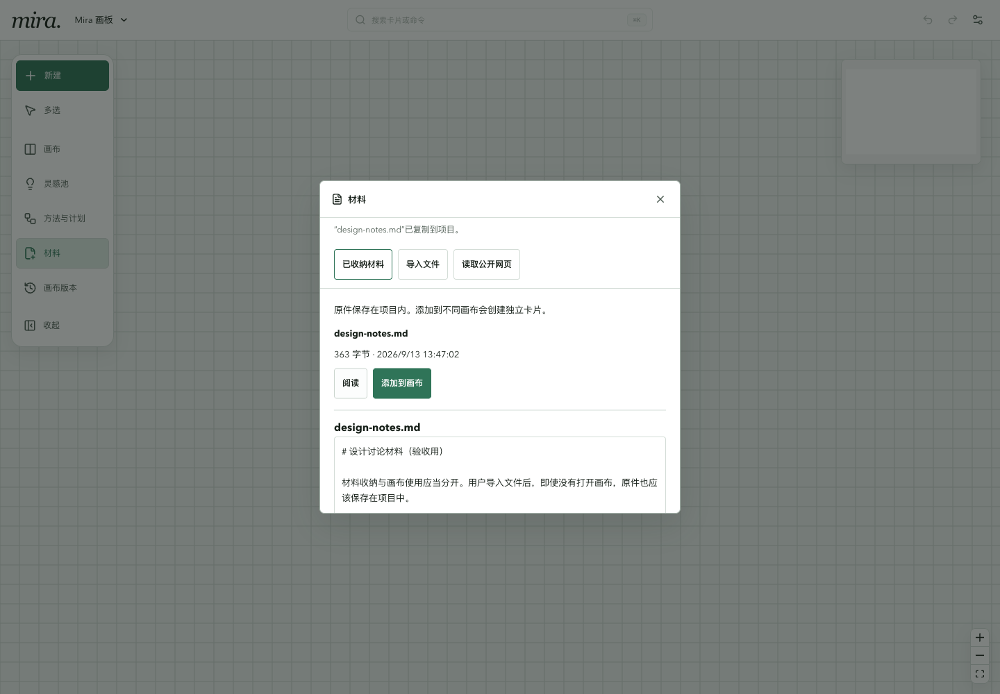
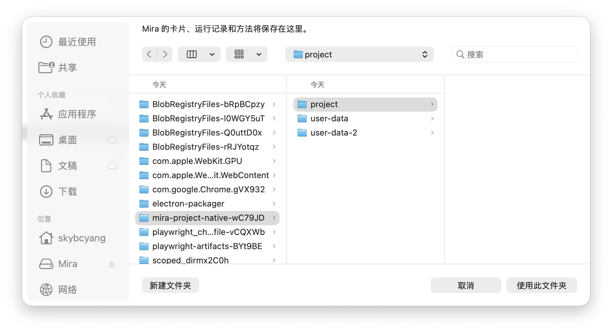
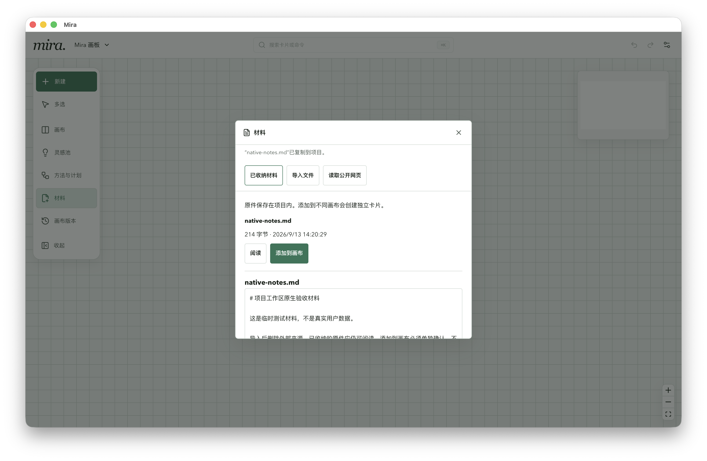

# 项目工作区本地交付验证

日期：2026-09-13。基线 `b5cb2a9`，交付分支 `codex/project-workspace`，隔离工作树 `.worktrees/project-workspace`。用户确认的产品命题见[项目工作区规格](../specs/project-workspace.md)，剩余交付项见[统一 TODO](../refactor/evolution-todo.md)。

## 产品命题与结果

一个项目可同时存放代码、成果文档与 Mira 多个画板；明确导入的材料复制到项目内，不因原文件移动而失效。材料共用，卡片仍是独立内容对象，跨项目复制携带本地原件，不自动同步、选取来源或运行模型。

新 Node 工作区使用 `.mira/` 和稳定 workspace 身份；旧根级 v2 数据直接兼容，不自动迁移。显式离线迁移只复制 Mira 管理对象到全新/空目标，源文件不改写；未收纳的旧引用仍需明确导入。材料目录使用内容地址、逐次摘要核对与原子目录提交；文件绑定拒绝内部目录和受管原件，但继续允许普通项目 Markdown 成果。

BoardArtifact V2、Backup V3 与检查点带原件；跨项目所选卡片包只复制当前 Head、必要材料和相对布局，创建新 Card/Version 身份并保留只读出处。导入最多 100 张，与一次会话撤销的批量上限一致。已有材料不重复安装；失败和重启恢复覆盖 Board 前态与本次新增材料。

## 实现正确性

先运行新增失败用例，再最小实现；基线为 155 files / 1609 tests，最终为 **160 files / 1634 tests passed**。

| 检查 | 实际结果 |
| --- | --- |
| `pnpm test` | 160 files、1634 tests，通过 |
| `pnpm exec tsc --noEmit` | 通过 |
| `pnpm build` | 通过，2342 modules |
| `pnpm build:bridge` | 通过 |
| `git diff --check` | 通过 |
| macOS arm64 `pnpm desktop:make:arm64` | 未签名 `.app`、DMG、ZIP 构建通过 |
| `pnpm desktop:smoke:packed:arm64` | 包内启动、材料导入、真实 PDF 解析/原页渲染与 Backup V3 原件检查通过 |
| `node scripts/packed-desktop-smoke.mjs --arch=arm64 --restore` | 旧 Backup V2 恢复兼容 smoke 通过 |

环境：macOS 26.3.1 Apple Silicon，Node 26.7、pnpm 9；完整测试输出有 Node 的 localStorage 实验性提示，未出现测试失败。它与实际浏览器 console 检查分开记录。

主要定向证据：

- `test/bridge/project-workspace.test.js`：新布局、稳定身份、旧布局不搬迁、异常/混合布局与符号链接业务目录拒绝。
- `test/bridge/managed-materials.test.js`：项目内文件复制、并发同字节去重、源文件删除/更新后旧原件可读、跨项目逐字节安装、摘要/路径/符号链接/超限拒绝，以及不覆盖损坏旧目录。
- `test/bridge/project-materials-integration.test.js`：无 Board 收纳、Board 包复制、完整备份恢复、受管目录绑定保护、卡片包新身份/出处/CAS、检查点继续与恢复后原件、批量上限和最长标题。
- `test/bridge/material-import-recovery.test.js`：提交失败即时回滚；回滚再失败后使用全新 coordinator/committer 恢复，旧 Board 精确还原，新资产移除、日志清空。
- `test/bridge/project-migration.test.js`：旧数据复制到新布局、源字节和目录不变，拒绝普通目录/源内目标/非空目标，不扫描其他项目文件。
- `material-service`、`node-pdf-reader`：网页只在明确保存后收纳、预览结果复用；PDF 预览后原件变化拒绝错误出处，解析前核对真正冻结字节。
- `mira-http-portability`、`src/v2Store.canvas.test.ts`：卡片导入 HTTP 总量限制、取当前 Board revision、一次 create history；现有 Board 导入、备份、Candidate、Run、文件绑定与 CanvasHistory 回归随完整测试执行。

最终整合 diff 单独复核存储锁顺序、材料所有权回滚、旧格式恢复、路径约束、来源 ID 不解析到目标对象、导入撤销上限与 UI 迟到结果。审查发现的批量上限及长标题问题已补失败测试修正；没有以子模块自测代替完整集成门禁。

## UX 可发现性与界面

真实有界面 Chrome 使用独立临时 workspace，在 1440×1000 和 390×844 验证：

1. 从既有`材料`入口导入项目文件，成功明确显示已复制；材料库可阅读完整原文，再明确添加到画布。
2. 从所选卡片更多操作导出包，在管理全部画板内选择包、核对 1 张卡片/1 份原件后确认。核对新身份与复制出处，撤销只移除新卡，原卡保留。
3. 关闭全部画板后材料库仍可打开、阅读；添加命令禁用，不偷偷新建画板。
4. 390px 浅色与深色无水平溢出，dialog 宽 358px、左右 16px；正文在任务内滚动。Tab 到底部关闭原文按钮会滚入可见区域，无焦点遮挡。

浏览器采集的 `pageerror` 与 console warning/error 均为零。首次使用的真人理解成本尚未测量，不把开发者能完成操作等同新用户研究通过。

窄屏证据：[浅色 390px](assets/project-workspace/materials-390.png)、[深色 390px](assets/project-workspace/materials-dark-390.png)。

## 原生桌面与产物质量

本机未锁屏真实 macOS 会话中，通过本批打包 `.app` 和独立 userData 启动原生 chooser，选择临时 `project` 目录，核对实际记住的 workspace 路径、新 `.mira` 布局和可见窗口。原生窗口内完成导入测试 Markdown、读取原文、添加一张卡片、Esc 关闭材料任务；Tab 焦点可见、1440px 窗口无水平溢出，renderer warning/error 为零。原生 chooser 与窗口截图如下：

一次选择器自动化尝试因焦点未就绪选择了 Downloads，立即停止该隔离进程；检查其原有 Board 的修改时间仍为 9 月 9 日，Run/Workflow 为空，未创建 `.mira`，锁已释放。随后用新独立 userData、逐步核对原生路径后完成上述临时项目验收；没有迁移或改写用户实际 MiraWorkSpace。此操作偏差不计作成功证据。

文本与二进制原件的字节、完整性、PDF 冻结解析和包恢复是本批产物质量证据。本次不调用付费模型，不新增真实模型质量声明；A3–B8 的既有模型质量问题仍单列原报告。

## 限制与交付边界

- 本次构建和实际交互证据只覆盖本机 macOS arm64；未替代 Intel、Windows、真实触屏或签名/公证验收。
- 单原件 64 MiB，PDF 读取 25 MiB，Board/卡片包 64 MiB、完整备份 256 MiB（含 base64 开销）；Checkpoint 自带 artifact，备份总量可能重复包含其原件，不承诺跨检查点压缩去重。
- 不提供同一卡片多处实时同步、材料自动清理、OCR、登录网页读取或项目目录自动扫描。相同字节复用首次记录的名称/网页出处。
- 旧 Backup V1/V2 继续恢复到旧布局；旧引用的当前内容不能冒充历史快照，迁移不自动拷贝这些依赖。
- 代码、文档和本地 arm64 内部产物已准备；未合入 main、推送远端、替换 `/Applications/Mira.app` 或迁移实际用户工作区。测试 Host/浏览器/应用进程已退出。
